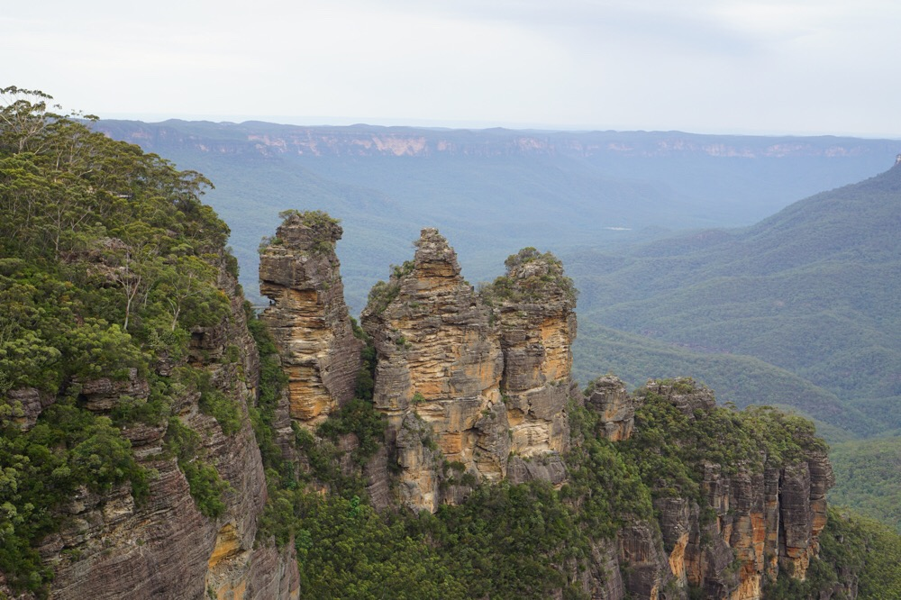

Title: Eucalyptus in the Air
Date: 2016-12-31 14:24:46.156070
Slug: eucalyptus-in-the-air
Tags: Travel, Australia
Status: published
Description: A great day touring the Blue Mountains

One great way to get over jet lag is to just get up in the morning and get going again.  Although we only made it until 8:30 last night we did manage to sleep until about 4 AM.  Our Blue Mountain tour started at 6:30 AM so we were wide awake and ready to go with no trouble.  We had a great guide for a day long tour out into the Blue Mountains outside of Sydney.  After a 90 minute drive from Sydney we stopped for Tea and Scones before our visit to Echo point to see the three sisters Meehni, Wimlah and Gunnedoo.  Legend has it that their father turned them to stone rather than let them marry three brothers from a rival tribe.

Aboriginal legends in Australia are just as believable as the native american legends in the USA.  However if you look closely at the picture you'll notice there are actually four pillars of stone, the smallest one is their little brother Dave.  Made famous a few years back when the locals started a social media campaign to #RememberDave.

There are a lot of great hiking trails in the area, including one which will bring you right over to the three sisters.  We were on an easier tour instead of a several mile hike we got in line at Scenic World and rode the gondola across.  This gave us a great, if fleeting, view of some waterfalls.  From there we took another gondola on a steep descent into the rain forest.

Once you are in the rainforest they have three options:  a 10, 20 or 30 minute walk through the forest on a nice safe boardwalk.  At the end you can ride up the train (the steepest in the world) to the top.  All in all it was very scenic and a nice walk but I think we would have preferred to skip the lines for the 'rides' and just walk the trails on our own.

After a very nice lunch of fish and chips we made our way to  Featherdale to have our picture taken with a Koala and to feed the Kangaroos.  Before we arrived I was calling it the 'petting zoo', but in the end it turned out alright. Coming face to face with a real Kangaroo is definitely cool.

![../images/Australia/koala.jpg]

In addition Featherdale had lots of really interesting native animals including a Tasmanian Devil -- it doesn't look anything at all like the one from the bugs bunny cartoons.  But its jaw muscles are among the strongest in the animal kingdom.  We also saw a Cassowary - think a turkey crossed with a Velociraptor.  In fact they say it is a holdover from the dinosaurs.  They have a hard crown (called a casque) on top of their head which is probably used as a sound box or radar for picking up the low frequency calls these creatures make.   The Cassowary an endangered species but almost nobody has heard about them because they are not nearly as cute as the Koalas.  They can jump six feet in the air and sprint 30 mph! I would not want to be chased by one.

To round out the day we had a quick tour through Sydney's Olympic park.  Still a very vibrant area to this day.  And then a water taxi ride back to the Circle Quay in the heart of Sydney.

The picture of me at the top of this post was taken on another little side trip to a place called Lincoln's Rock.  It just demonstrates the importance of perspective when you are framing a photo.  I can assure you that I was never in danger of anything more than a broken leg had I managed to somehow slip off that ledge.

