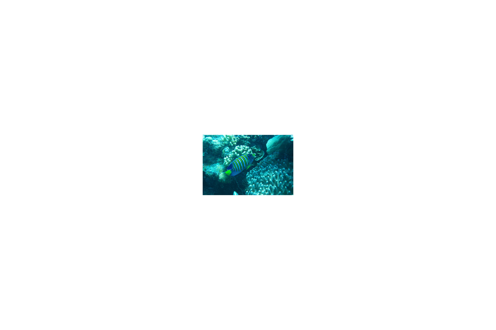

Title: Great Barrier Reef (batman)
Date: 2017-01-05 19:40:19.977844
Slug: great-barrier-reef
Tags: Travel, Australia, Diving
Status: published
Description: A day on a live aboard turns out to be the highlight -- so far

WOW!  we haveve just finished a day on a live aboard dive boat where we did 4 dives and 2 snorkels on the great barrier reef.  I saw Nemo, Dory and all the rest, except for Crush!  Plus we saw sea slugs, octopus, sharks (not Bruce!!) lobster, and many many more.  My ear is a bit plugged up from the four dives, but its worth a few days of having the world sound a little muffled.  I haven't even mentioned that one of the dives was a night dive!  We stood on the ship and looked at the reef sharks swimming next to the ship and still jumped in with our "torches."

Night diving is definitely a bit eerie and I'll admit I was a bit nervous about that one.  It was quite the sensation to be underwater-weightless and in complete darkness except for the light from your own flashlight. We saw a lot of fish that we did not see during the day and of course we saw a bunch of sharks.  Not the man-eating kind, just the normal kind that are more afraid of us than we are of them.  The most common fish we saw on the night dive was the Giant Trevally.   They were not afraid of our lights, and in fact  knew just how to take advantage of them.  If you held your light on a smaller fish for too long one of these big Trevallys would swoop in and ... there would no longer be a smaller fish there.  Unfortunately we did not get any pictures during the night dive, but the next morning we did a 6:30AM dive and were rewarded with a glassy sea and crystal clear water for viewing lots of active fish.

The boat we were on was called Reef Encounter and was by far the best diving experience ever!  The crew was really knowledgeable and really helpful with novice and rusty divers alike.  Our guide for the whole trip was Hugo and and he was fantastic.  He was very patient with reminding us of all the details of setting up our gear, and let me descend as slowly as I needed to in order to keep my ears from exploding.

The live aboard boat is really the way to do the great barrier reef as you don't spend three hours of your day getting out and back from the reef.  Rather you can spend most of the first day diving, and again the second day you can start first thing in the morning.  We transferred to the boat from shore on a day excursion boat that tied up with our ship to let us off and then pick us up again the next day.   We had great company while onboard and because we were a part of the "Top Deck" program we ate our meals on the top deck with just a few other people that we enjoyed getting to know.  In addition since things are very informal and everyone is on there to snorkel or dive we only brought our day packs with swimming suits, toiletries and an extra t-shirt.  They don't allow any shoes on board so there was no worrying about extra shoes to wear to dinner either.

When we returned to Cairns it was pouring rain and our guy Hugo offered to escort us off the boat with his umbrella.  Sadly it was not an umbrella built for 3 and the wind was blowing so hard that the rain was mostly horizontal anyway, so even the nicest umbrella in the world would not have helped too much.  The reception at the Shangri La was super nice when we arrived and immediately gave us towels to dry off with while they checked us in and retrieved the luggage we had stored there while we were on the live aboard. 

