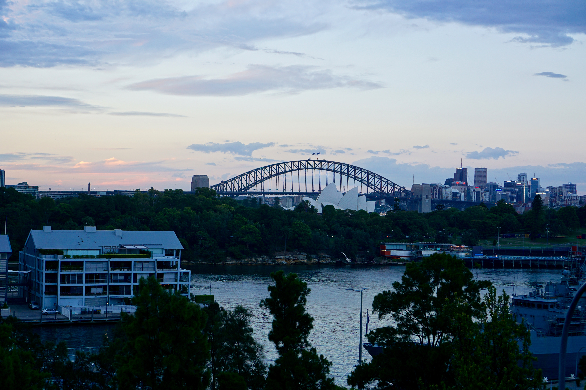

Title: Hello Nemo!
Date: 2016-12-31 06:46:15.648594
Slug: hello-nemo!
Tags: Travel, Australia
Status: published
Description: Our Australian Adventure Starts in Sydney

I'm sitting by the window of our flat in Pott's Point with the view you see in the picture above.  (Except its morning now).   We are starting to get past the jet lag that comes from being 15 hours ahead of home base with the help of a couple of event filled days that kept us moving and awake.  Today we are going to do something more relaxing in advance of the huge new years eve celebration tonight.

The flat that we rented has this spectacular view of the harbor and the city skyline.  But it lacks one key ingredient for the three days we happened to be here for.  Air Conditioning!  The weather in Sydney is very unseasonably warm.  When Jane did the research we learned that the average temp is in the high 70's this time of year, so AC didn't even cross the mind.  Unfortunately our first day here the temp was nearly 100 and yesterday was mid-90's.  So we come home at night to a very warm place to sleep.  Luckily even the heat can't keep us awake come 9-10:00 at night.  I slept pretty well through the night last night so I'm hopeful that midnight is an achievable goal.  I'm definitely looking forward to wishing everyone a Happy New year when it is only morning of New Years eve in your time zone.

Our first day in Sydney we explored the Botanical Gardens and the area around the Opera House and the bridge.  It was miserably hot and we were way out of whack with jet lag, so even now, I'm not sure how clearly I'm remembering everything.  We had a nice lunch at a place right on Woolloomooloo bay - yes thats a real name.  Lots of things in Australia have the 'oo' in their names.  This is a combination of Aboriginal pronunciation and the teaching  of phonics (Not sure phonics was a thing in the early 1800's).  After our late lunch we walked to the Opera house, we were able to get into the lobby but no further as their was an afternoon performance going on.

At this point we had planned to hike over to the bridge and go up one of the towers.  But we nearly cracked in the heat.   A short rest and some re-hydration gave us a second wind and so we continued to wander around, eventually making our way to the bridge.  We made our way to the top of the tower just 15 minutes before closing and were rewarded with some really spectacular views of the harbor!

By this time it was after 5pm Sydney time and the middle of the night to our bodies.  Our feet were tired from walking so we gave in and grabbed a cab back to the flat.   We worked really really hard to stay awake until about 8:30.  But sleep took us, at least until about 3am!

