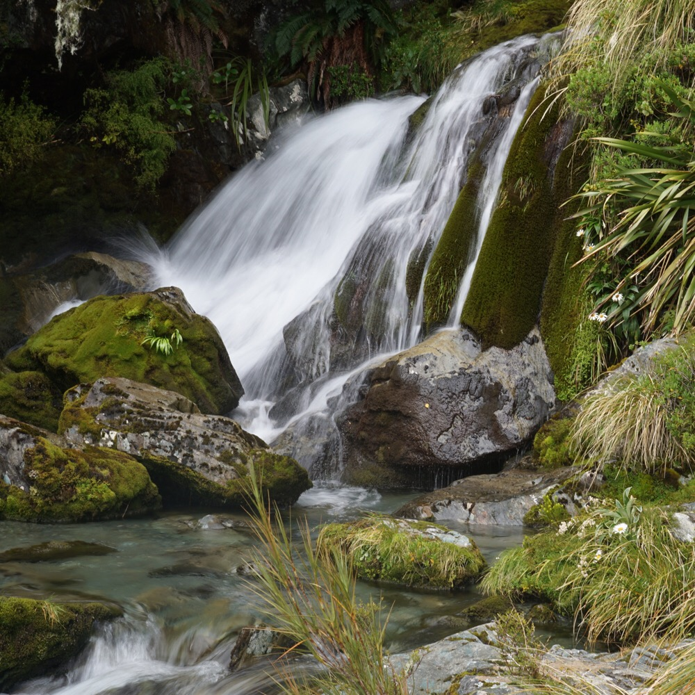
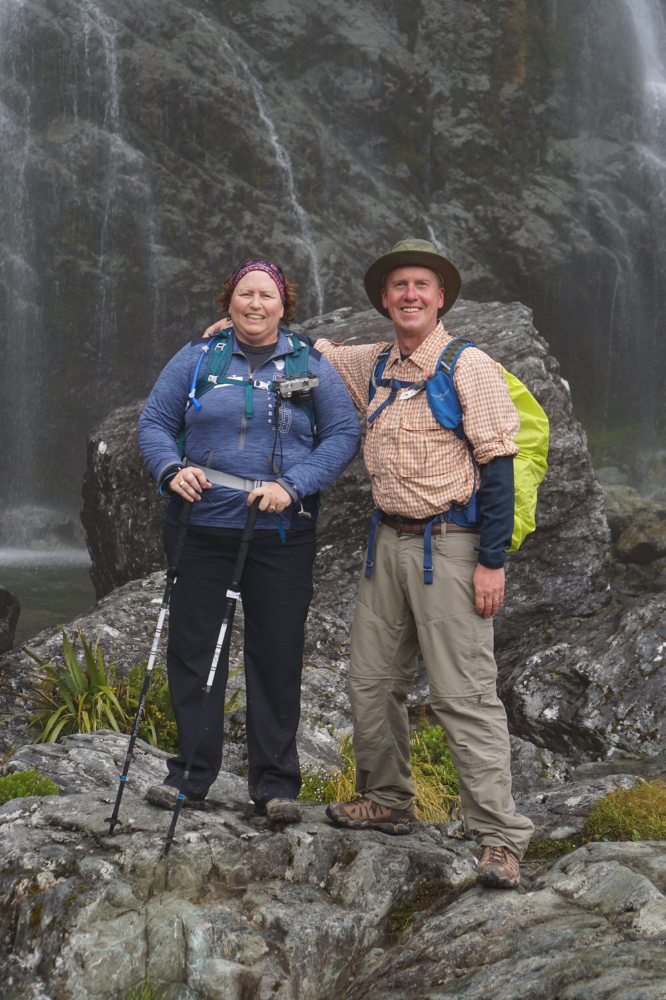
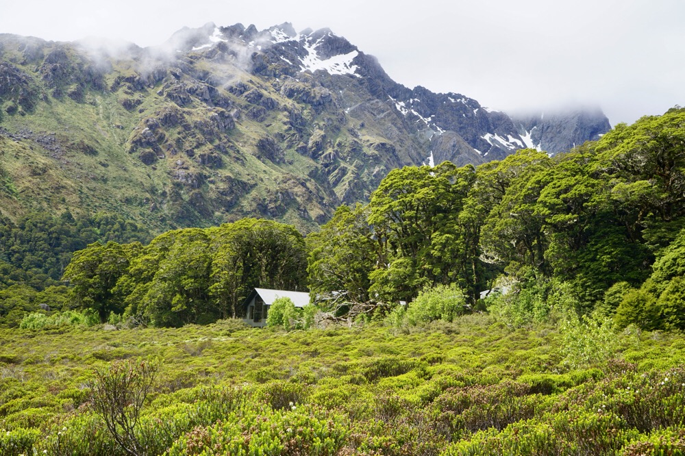
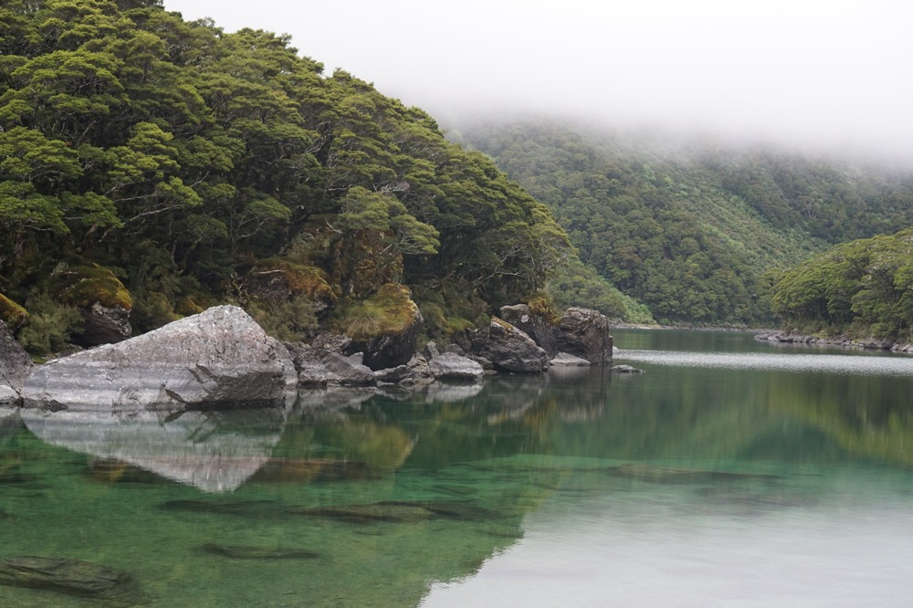
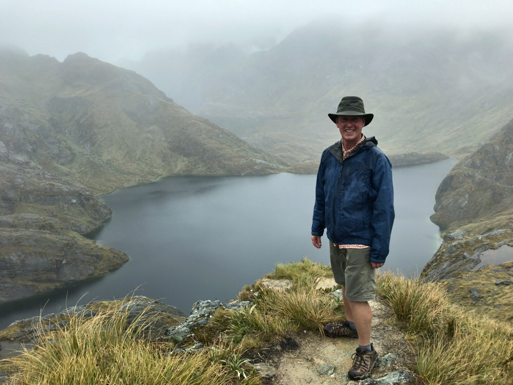
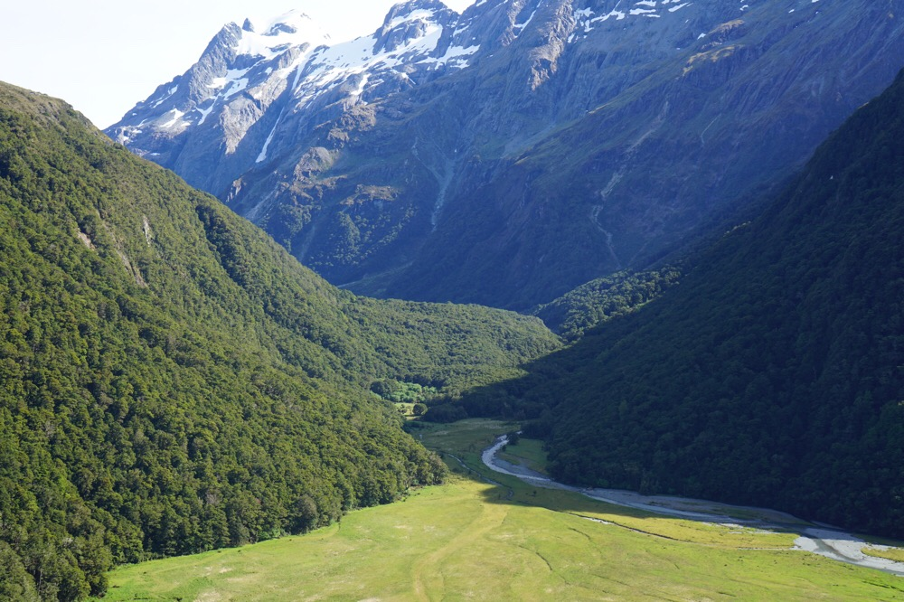
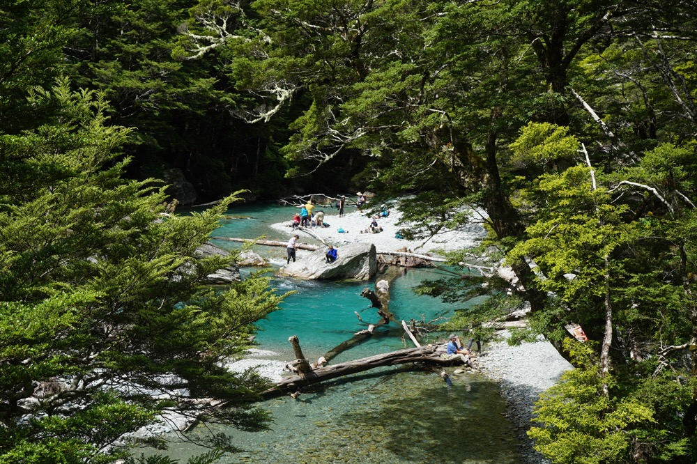

Title: Three Days on the Routeburn Track
Date: 2017-01-12 13:08:01.090732
Slug: three-days-on-the-routeburn-track
Tags: Travel, NewZealand, Hiking
Status: published
Description: Getting to know New Zealand on one of its most famous treks

## Day Zero

We arrived in Queenstown just in time to appreciate the change in temperature. We left the 90 degree weather in Melbourne and arrived to 70 degree weather in Queenstown.  It was a very welcome change in both temperature and scenery.  It takes about 30 seconds to realize why Peter Jackson decided to film Lord of the Rings here!  The steep Mountains and misty low clouds around Lake Wakatipu  make you want to break out into some  dwarf songs.

We had just enough time to check into the St. Moritz before a short walk down the hill to the Ultimate Hikes center for our pre-hike briefing.  Now is a good time to note that Jane and I have. noticed that we are no longer the young couple on the tours we have chosen.  Most of the people we have met and toured with so far on this trip have been 20 years younger than us.  Life Happens!  As we contemplated 3 days of hiking with 30 year olds we were getting a bit nervous.  So, we were pretty relieved to see that the vast majority of the 27 people at our briefing were in our age bracket.

> There is no bad weather, only bad gear!

If I didn't take anything else away from the briefing it was this quote.  And we were really glad that we had done our homework and invested in some good rain gear and merino wool.

## Day One

The first day of the trek kicked by meeting our guides -- Jono, Anthony, Sadao, and Jo -- then a bus ride leaving Queenstown at 6:30AM.  We had a two hour bus ride until our stop morning tea in Te Anau.  Every tour in Australia and New Zealand includes a stop for morning tea and scones.  Very civilized.  We had a couple more hours on the bus after morning tea before we got to the start of the trek in the Fiordland National Park.  This first day we had around four hours of trekking (7.5 miles) to get to our first night's lodging at Lake Mackenzie. The first hour and a half was all up hill pretty steadily, so even though we were geared up for the 50 degree weather and rain we began shedding layers only a few minutes into the hike.  With four guides, one was at the front, one at the back and two floated between people in the middle.  It didn't take long for us to stretch out with the back being about an hour behind the front.  We were somewhere near the middle.  

We carried our lunches in with us, and we carried the rubbish out.  The National Parks in New Zealand have no rubbish bins to prevent animals from learning to scavenge food.  It works well.  I don't think we saw one bit of litter anywhere along the track.  We hiked uphill to Howden Hut where we had our lunch stop along with hot tea and coffee made by our guides.  We walked out of the rain shortly after lunch and enjoyed a really scenic hike through the afternoon.  The highlight of the afternoon was definitely the Earland Falls.  Anthony said, make sure you have your inhalers, it will take your breath away.  And he was right.  As with many of the sites on our trip pictures don't do justice to the actual scene.

We arrived MacKenzie hut around 4:00 and we were definitely ready to stop for the day.  We were met at the entrance by Chris who had hot chocolate (called Milo here down under) and snacks for us.  He gave us a quick tour of the lodge and showed us to our room.   We were  blown away by the accomodations.  Ultimate Hikes made some kind deal with the Department of Conservation (DOC) whereby they built new facilities for the park in exchange for getting the concession for guided hikes and the ability to build their own huts on the track.  They were so clean and nice.  We had our own room with ensuite and shower.  There was a clothes washing area, and a huge warm room called the drying room.  Then a really nice common area where we could hang out, have a drink, eat our meals and get to know the rest of our group.  

For dinner tonight we had entrees of Hummus or Salmon spread with cheese and meat.  For our main we had  our choice between a New Zealand Rib Eye and Chicken.  For desert we had brownies and ice cream.   Yes we were "roughing it" all right.  It took us a few meals to understand that in Australia and New Zealand they call appetizers "entrees" and the entree is called the "main."

Unfortunately the first night we also got to watch a helicopter landing.  One of our group had fallen on the track and broken her wrist and hurt her leg pretty badly. So, she and her husband were evacuated by helicopter.  The rescue team landed on a tiny little pad right next to the hut.  Clearly these guys know what they are doing to drop out of the clouds and land right on target.

At 10:00 the generators are shut off until 7:30 the next morning.  But that really wasn't a problem as we were all in bed by 9:30 that first night!  I was talking to one of the guides about their arrangement with the DOC and he said that the generator times, along with every detail down to the dishwashing soap and toilet paper was negotiated to have minimal environmental impact on the National Park.   Everything at the hut is flown in and out by helicopter once a week.

## Day Two

Day two began with sandwich making at 7:45.  Amazingly we slept solid until 7:00 when I needed to get up and use the ensuite.   A few experimental steps revealed that all the limbs were still working as they should with amazingly little stiffness.  Continental breakfast was at 8:15 followed by eggs Benedict at 8:30.  At 9:15 we met for a group photo by Lake Mackenzie and then we were off for a good six hours of walking.   The beginning was again steadily up hill, then we rounded the mountain onto the rainy and windy side! The distance for today was just 6.9 miles but it was slower going than yesterday! There is no bad weather, only bad gear I repeated to myself.  Nevertheless we made it to the hut on Harris Saddle for our rest/lunch stop.  After lunch I did the optional climb up Conical Hill while Jane continued on towards the Routeburn Lodge with a few others.  After the Harris Saddle and the Conical Hill the rest of the day was down hill  which was nice but pretty hard on my calfs.  

A couple times today we were rewarded with a glimpse of what a great view we could have on one of the rare clear days.  Still it was all beautiful in a Lord of the Rings kind of way.  Although I walked by myself most of the afternoon, I enjoyed just going my own pace and enjoying the views.

The second night we stayed at Routeburn lodge.  By the way if you've been reading Routeburn as "rowt burn" you are doing it wrong, it is "root burn." This lodge is very similar to the Lake Mackenzie lodge but with a great view of the valley and the Routeburn falls right behind.  We were all bit more tired and a lot more wet than we were the day before.  So dinner was served a bit earlier.  Tonights fare included a delicious Pesto soup as the entree followed by a choice of Salmon or New Zealand lamb chops.  By now we had gotten to know a lot of our fellow trekkers pretty well, so before dinner and during dinner conversation was very lively.  We have met a surprising number of people from Chicago on this trip and we have really enjoyed getting to know them, especially Dave and Lynn Reiner.  We also met lots of nice people from New Zealand including a couple women (Jennifer and Megan) who reminded me of Jane and Shirley if they had New Zealand accents and were to take off on their own adventure.  Lots of the people in the group were involved in education including the two women I mentioned and  Professor Tiano from Duke University in Singapore.  

It was nice to be surrounded by other academics as I was beginning to stress about the impending NSF grant deadline back home.  Leaving my co-authors to finish the proposal while I was totally off the grid for 3 days is not the best plan. Of course agreeing to do the grant in the first place when you know the deadline is in the middle of your holiday does not show the best judgement either.

## Day Three

I woke up at about 4AM on day three, once again needing to use the ensuite.  However my first couple of steps out of bed were so painful I spent the next couple hours in and out of sleep wondering if my muscles would loosen enough for me to walk down the track on my own power.  Thankfully day three dawned bright and sunny for the final 5.7 miles of our trek.  Once again we started our day with sandwich making followed by continental breakfast and then eggs and bacon.  Sadly it took me until day three to get lesson in making a proper cup of Milo from Jono.  To anyone who may happen upon this in preparation for a trip to New Zealand here is the procedure:  pour a couple tablespoons of cream into your coffee cup, then add six, yes six, spoonfuls of milo and mix it into a paste with the cream.  You may have to add more to get the right pasty consistency.  Then after you have a good chocolatey paste you can add the hot water.

Today's walk was the easiest of the three with the route being mostly down hill to the Routeburn flats and then more gentle downhill  for the 5.7 mile distance to the end of the route.  We had several intermediate stops along the way including an early lunch along the river.  By the end of the trek we felt like we had really experienced New Zealand at its best.  Great people, great scenery, no crowds, just lots of great natural beauty.

Our final stop of the trek was at the pub in Glenorchy for a schooner of ale and the presentation of our certificates of achievement!  Several suggested that this certificate of achievement would make a good addition to my bio for the grant proposal 😜

