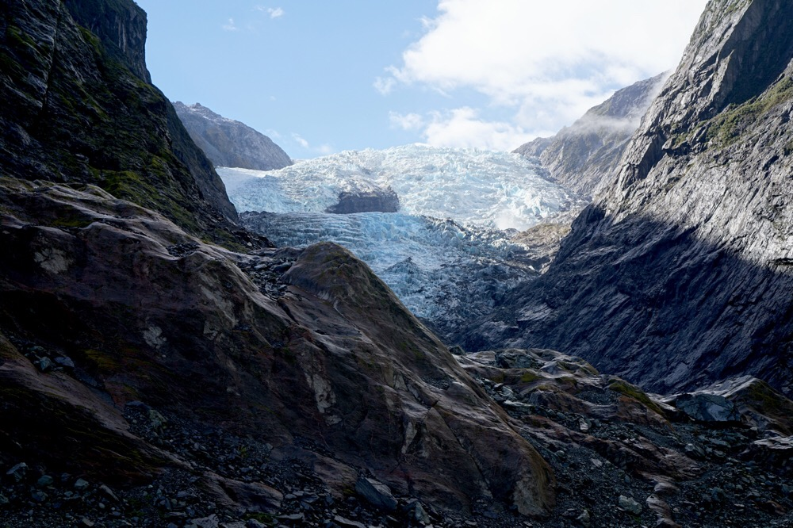
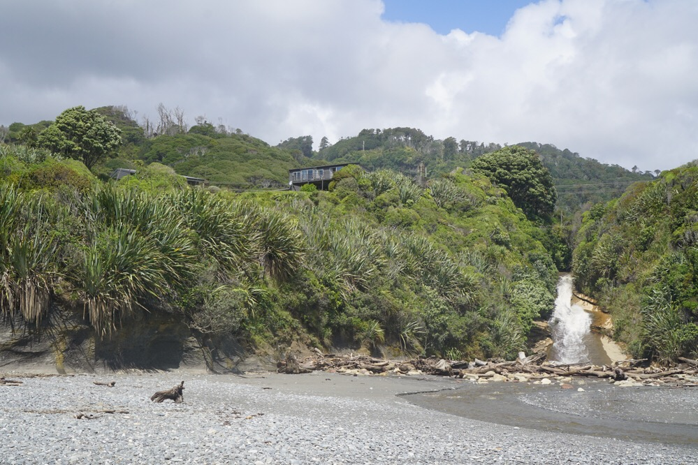
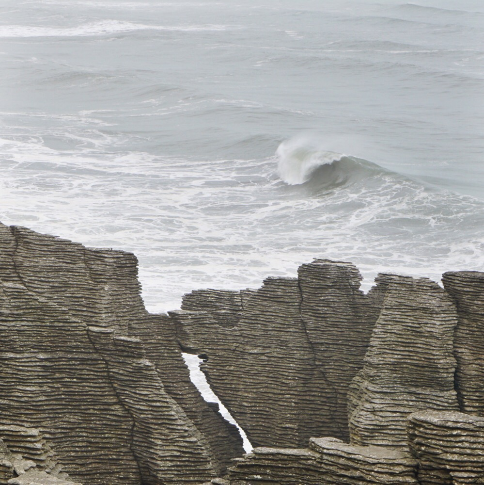
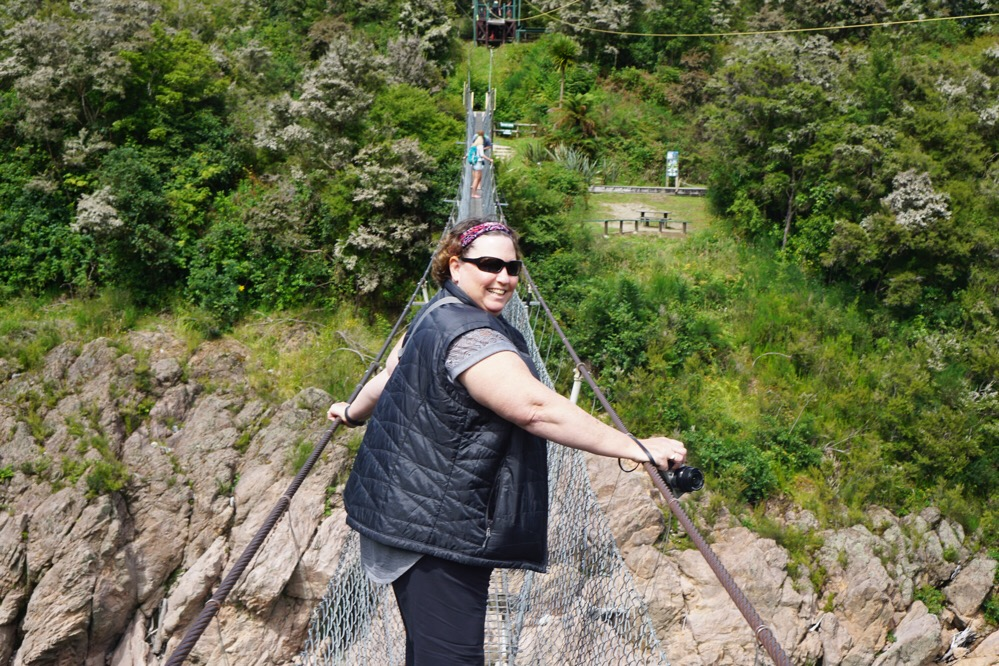
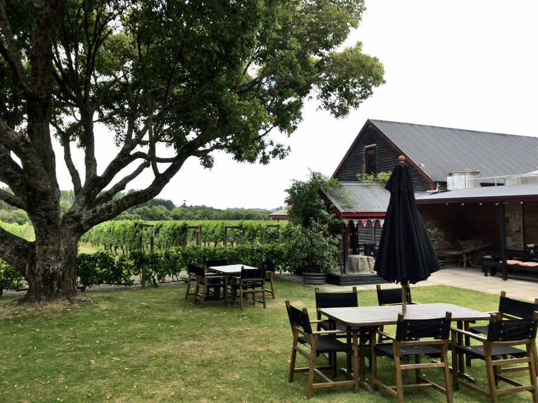

Title: Driving the West Coast
Date: 2017-01-13 18:16:23.029639
Slug: driving-the-west-coast
Tags: Travel, NewZealand
Status: published
Description: Free of big coaches for a few days we rent a car and head from Queensland to Nelson via the west coast

After two weeks of organized tours and bus rides we struck out on our own today in a rental car.  New Zealand drives on the left and there are many helpful arrows painted on the road to remind the foreign drivers of that fact.  As always, Jane took the drivers seat and I rode shotgun in on the passenger side.  We left Queenstown after a nice breakfast at the hotel and headed toward the west coast.  Our destination for the first night was Franz Josef.  A small little town near the Franz Josef glacier. 

A couple of observations about driving in New Zealand

* One lane bridges are everywhere!  We counted twenty seven one lane bridges on our 280km journey the first day.  I think this is part of the great environmental movement in New Zealand that they think really carefully before messing with anything in nature.  Sure it slows you down a bit and occasionally you need to wait for a couple of cars to cross before you can take your turn but maybe a reminder to slow down is a good thing.
* They have these nice bullseye signs that say 100 its not a target, drive according to conditions.  its pretty hard to drive 100km/hr anyway as the roads are very twisty.  I would guess we averaged closer to 60km/hr. 
* Cell phone coverage outside the cities is pretty much non-existent.  I'm pretty sure this is again related to the environmental focus of the country.  Don't mess up the countryside by installing thousands of cell towers.  This also impacts things like Google maps where the travel time estimates are wildly wrong.  If they don't get any feedback on the actual speed people drive the only thing they can rely on is the posted speed limits, which are way higher than almost anyone drives!

We stopped in the grocery store on the way out of Queenstown to pick up some meat and cheese, bread, and Ginger Beer,   so we could do a simple lunch somewhere along the way.   Once we reached the west coast, we drove in rain most of the day, and nothing we could see in a two minute walk from the side of the road could compare to what we saw on the Routeburn Track. Our lodging that night was at a small boutique B&B (The Westwood Lodge).  It was super nice, just like the host who gave us a nice recommendation to go to Alice May for dinner.  We did and we had a nice meal: Fish and Chips for Jane and I had a stuffed chicken breast with Brie cheese.

The next morning dawned sunny and clear, so we felt really great about our decision to postpone our visit to the glacier until the morning.  On the way to the glacier it started to sprinkle a bit again, but by the time we had hiked closer to the glacier we were rewarded with nice sunny weather again!  We were also lucky that we didn't try to go the day before because one of the wooden bridges across one of the many creeks had been washed out in a downpour the previous day.   we picked our way across the stone in the now-very-tame creek and continued to the glacier.

On the way back we noticed a couple of construction workers with their massive power tools standing around watching each other prepare to work.  We assumed that they were going to excavate and rebuild the bridge.  A project likely to take weeks at their pace.  Yes, construction seems to move at the same speed everywhere in the world.  But as we walked further we met up with a dozen cheerful  red-shirted volunteers carrying shovels and pickaxes.  They were headed to fix the bridge too.  I recon they took care of it by lunch time.

After our glacier hike we continued our way north.  We didn't have far to go and todays destination was a small B&B called Breakers, just north of Greymouth. We were met by the owner, Jan, who was a very delightful person to chat with.  She was amazed at how light we were traveling and suggested we may want to give lessons to some of her previous guests.  We arrived in mid-afternoon, with nothing else on the agenda except for lounging around and enjoying the view of the Tasman sea.  Huge wave after wave coming in from the west was mesmerizing.  We didn't even leave the B&B for dinner that night as Jan made us a nice homemade pizza to enjoy in the comfort of our room or on the nice back porch.

Our final day of driving was the longest, but we made some fun stops along the way to break up the driving.  The first was at Pancake Rock.  Once again great views of the Tasman Sea, Blowholes in the rocks and just really interesting rock formations to gawk at.

The second stop was a tourist trap, but we stopped willingly to wander across the southern hemisphere's longest swinging bridge.  Spanning the Buller Gorge it was a nice view, but not nearly so much fun to have to pass someone on the bridge.

Once we got closer to Nelson and realized we had plenty of time to spare before the rental car drop-off closed we decided to head into wine country and visit a couple of wineries in the hills Northwest of Nelson.  We made a stop at Kaharunga and Neudorf wineries.  This region is known for some pretty nice Chardonnays and rightly so.  We need to figure out how to get some Neudorf delivered to the US.

