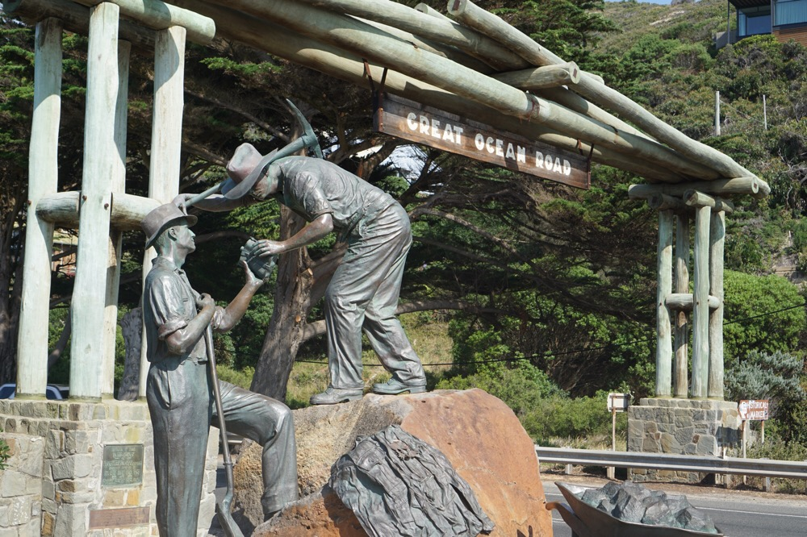
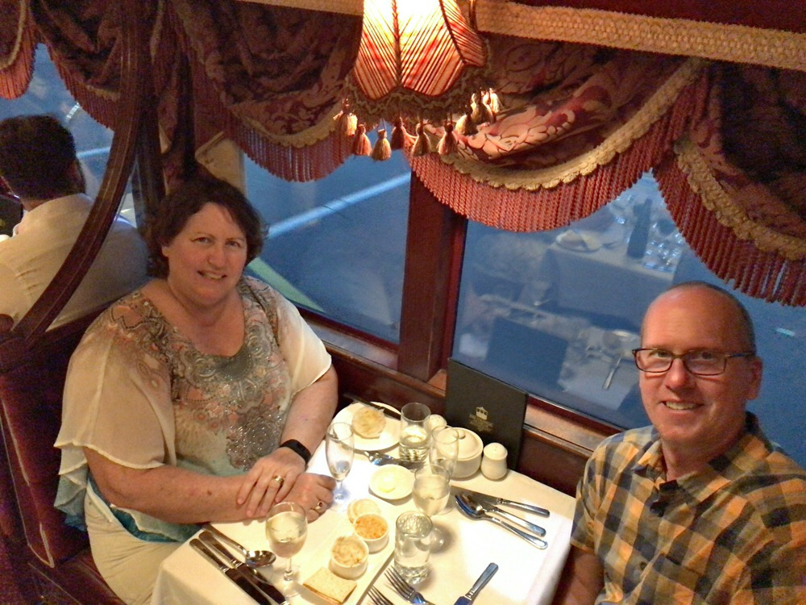
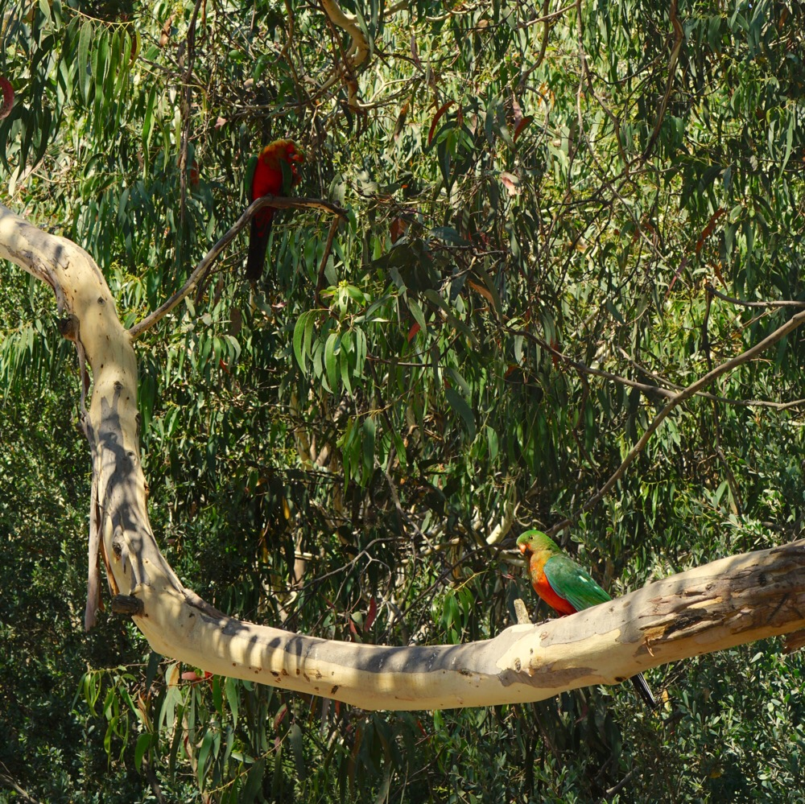
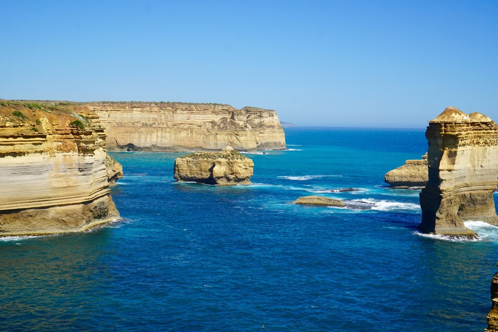
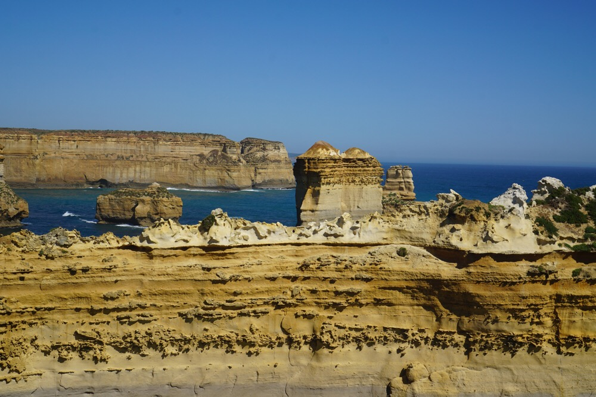

Title: The Great Ocean Road
Date: 2017-01-06 20:59:00.736504
Slug: the-great-coastal-road
Tags: Travel, Australia
Status: published
Description: A long, beautiful day on the Great Coastal Road

### Arrival and Trolly Tour

We arrived in Melbourne and took a little dinner tour of the city on a dinner trolly.  We thought it would be mediocre food, but a good way to see the city.  It turned out that the food was better than expected, and in the end we didn't see too much of Melbourne.  Still fun, and we got to see "The Original Taco Bills". Those of you who were at Luther in the 80's will appreciate the Taco Bills excitement.

### The Great Ocean Road

The great ocean road was built along the southern coast of Australia in the 30's by men in the ANZAC (Australia New Zealand Army Corps). These were primarily WWI soldiers who needed work, and time to recover from the war.  The statue at the beginning of the road commemorates these men.

Aside from our morning tea, and a lunch stop we made three main stops today:  One for a Koala and Parrot viewing, the second for a 30 minute hike in the rain forest and the third at the 12 Apostles.  Although the crowds were as thick as the flies the 12 Apostles were really the highlight of the day.  Fun fact:  The Australian government originally called these "the apostles" since there were only nine of them, but the tourists kept referring to them as the 12 apostles so eventually some marketing person in the government gave in and they renamed the site to the 12 Apostles and it remains that to this day.  The name is increasingly less accurate at the moment as one of the  9 came down a few years back.   However, in a few thousand years it is likely that the numbers will increase again as erosion along the shore does its work.

