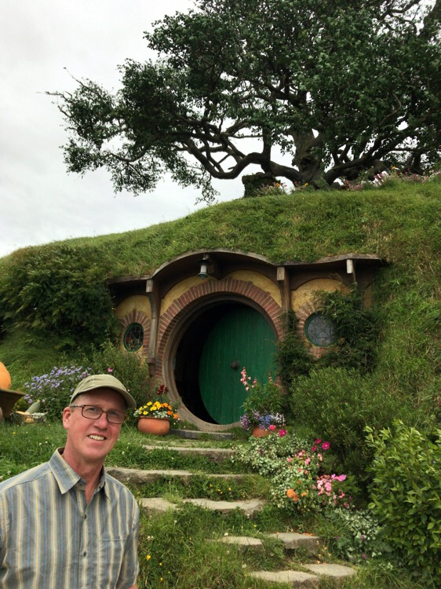
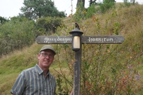
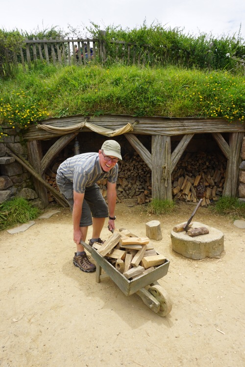
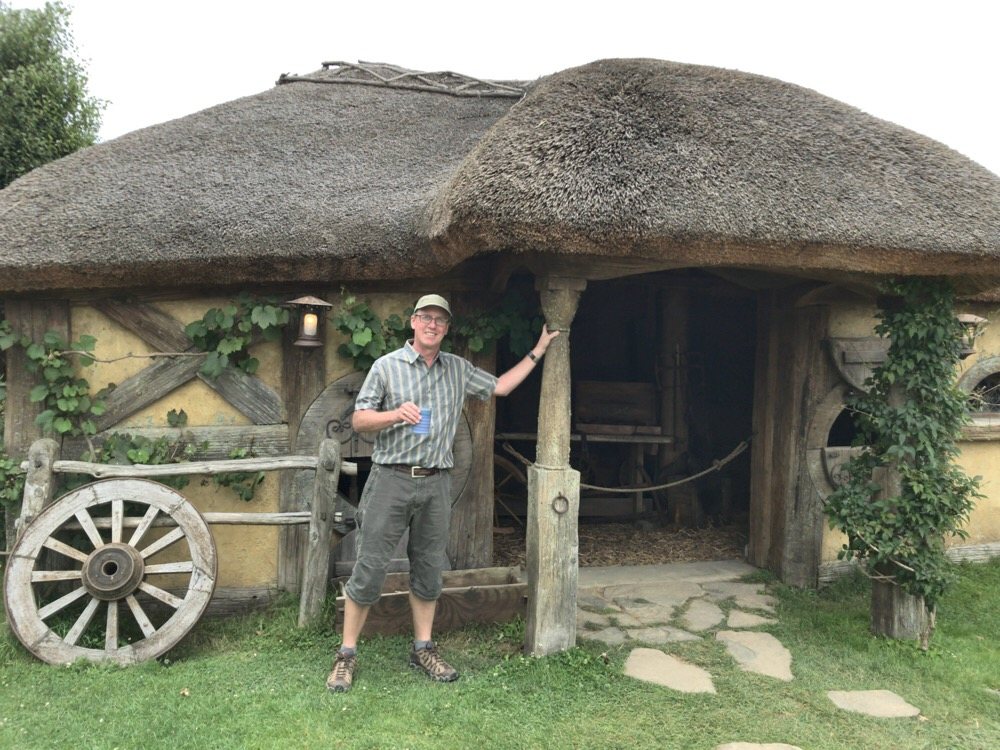

Title: Is this Hobbiton or Nerdvana?
Date: 2017-01-21 17:59:32.908376
Slug: hobbiton
Tags: Travel, NewZealand
Status: published
Description: A two hour tour of Hobbiton!

For as little as I wanted to go to the stinky spa yesterday, Jane wanted to go to Hobbiton today even less.  She's not a big Lord of the Rings Fan.  But our guide told us that nearly 30% of the people who visit Hobbiton have never seen even one of movies nor have they ready any of the books.  Having seen all of the movies more than once and read the books, I was at the top of my class for our tour group of around 30 people. I think there were two of us that admitted to loving Middle Earth that much.   Do you recognize where I am standing in the picture above?  If you said Bag End, you are correct!  The home of Bilbo and Frodo.  I swear that even though I was with a very unruly tour group I could almost convince myself I was "really" there at times.  Oh, yes my vivid imagination.  Only slight eye roll from Jane.

We got there early thinking we might be able to get in on an earlier tour, but as we listened to the people who had not pre-booked their tour in front of us learn that the next available slot was 5:00 this afternoon or tomorrow we realized that we were going to have an opportunity to enjoy our crackers and cheese that we had been bringing with us for the last couple of days.  Crackers, cheese, meat and Ginger Beer, make a pretty good picnic.  I went into the gift shop to kill a little time and other than a bottle of Middle Earth wine, I was pretty much ready to leave immediately.  I was struck by the fact that they were selling "The One Ring" in multiple sizes!  (what!?) for only $190.00.   To be honest I knew this was coming because our tour guide, Robo, on the great ocean road told me he bought one.

 Hobbiton is largely preserved as it was after it was rebuilt for the Hobbit trilogy.  Its amazing to me that for Lord of the Rings and the Hobbit there was less than 4 months of filming here.  Our tour guide told us several stories about how much Peter Jackson was obsessed with staying true to the book and keeping things logical.  For example we passed by some apple trees in a small grove, in the books this grove was described as plum trees.  So, Jackson made someone take all the apples and leaves off the tree and put on fake leaves and fake plums for a shot that got less than 5 seconds of screen time.  You can only imagine the outcry of true fans who would remember that they were supposed to be plum trees but saw apples on the trees in that little segment instead!  

Another example; in the picture of me at Bag End, the tree above me is actually fake!  It was a beautiful old oak tree in the Lord of the Rings, but since the Hobbit was supposed to be 65 years earlier than LotR Jackson made the crew chop it down and replace it with a fake younger tree!  Even worse, the company in charge of making the fake leaves did a bad job on the leaves and they had faded by the time filming was supposed to start.  So, Jackson ordered someone to repaint all 200,000 leaves on the fake tree!

We also learned a bit about film tricks for making people look bigger and smaller.  Some of the hobbit holes were made quite small so that when an adult human stood beside the door they looked very large.  Others were built at full size so that the door would look fine when a hobbit was standing next to it.  In other cases parts of the set were created special to create a perspective effect.  For example the wagon that Gandalf and Frodo are riding in the wagon together the wagon was constructed to be 3 meters long.  Gandalf rode in the front so that he looked very big while Frodo sat in the very back so that when filmed he looked very small, and like he was sitting next to Gandalf.

At the end of the tour we stopped at the Green Dragon for Ale!  I don't think this was where the scenes were filmed as every other structure here was created for filming from the outside in, or with just enough room for the camera crew to film from the inside out.  All indoor scenes were filmed in the studio, but this is part of the process of making Hobbiton more interesting for visitors.  We had a couple of choices of Ale, a cider, or a Ginger Beer.  This was also a great place to get some pictures of the Green Dragon along with the Mill and the pond.

 The tour really makes you appreciate camera angles!  On the bus back to the gift shop we saw some video clips from the movie and its amazing how large everything looks compared to how it seems in person.  I can't wait to get home and watch the extended edition disks that Josh bought me for Christmas.  Maybe with a few days off we will find time to watch them together.
 
 Today was also our last day in New Zealand and marks the beginning of the journey home.  Tomorrow morning we fly to Fiji!  The Novotel airport is just 25 yards from the entrance to the international terminal, so one good thing is that we don't even need a cab to get to the airport in plenty of time for our flight!   I'm looking forward to a couple days of R&R on the water!
 

