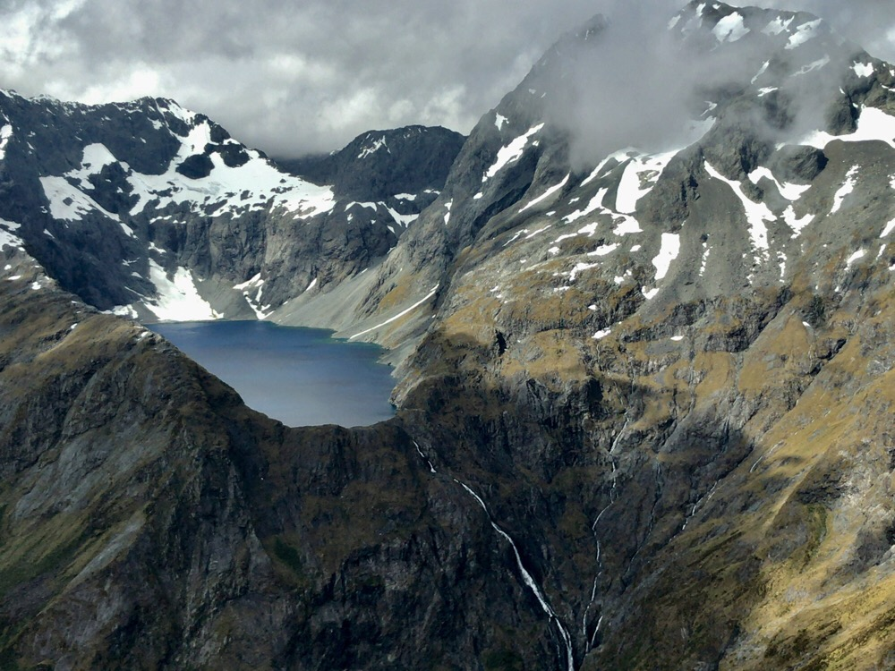

Title: Milford Sound
Date: 2017-01-12 17:36:37.225834
Slug: milford-sound
Tags: Travel, NewZealand
Status: published
Description: A day on Milford Sound that was way better than expected

As we walked back from Ultimate Hikes to the Lovely St. Moritz hotel we stopped at the Real Journeys office to check on our reservation for Milford Sound.  We had sort of concluded that if the helicopter return was not going to go, and we could back out at this late time, we would cancel and just enjoy a day of leisure in Queenstown.  The Helicopter was not confirmed, we were the only two booked, and they need at least four people booked to fly.  But we couldn't cancel either. -- Real Journeys take note, this is a terrible and unfair policy!  To charge someone full fare to cancel a flight that is not even confirmed is ridiculous.  With the NSF grant deadline about 36 hours away I was ready to cancel anyway and stay in the room to finish up my work on the grant.

The morning came and it was sunny and nice in Queenstown, so I did a bit of grant work and decided I would take my iPad on the bus.  After all, I had already seen the first four hours of the trip on our journey to the Routeburn Track!  The first bit of luck for the day was that the bus had WiFi!  At least until just after Te Anau.  So, I had about three hours of time to work on the grant and upload things to the NSF website.  By the time we got to Te Anau I was feeling really good and I had all of the stuff for Luther uploaded.

The next bit of good news was that our driver seemed pretty confident that even though the clouds were really low and the fixed wing planes were on hold, the helicopters would still fly.  But we still would not know whether we had another four hour bus ride at the end of the boat tour of the sound or whether we would have a nice 45 minute helicopter tour back to Queenstown at the end of the boat ride.  We would just have to wait to know for sure.  But again, Barry the bus driver was optimistic.

The two hour boat tour of Milford Sound was really great.  The boat moved along slowly just a few meters from the sheer mountainside.  The walls of the mountain come straight out of the water and soar 5-6 thousand meters over us.  You really can't grasp the scale of it unless you see another boat or some people to give you an idea.

When we made it to the Tasman sea at the end of the sound and looked back we marveled that anyone would ever think to try to bring a ship there!  You can't tell from the oceanside that there is this narrow sound leading back to a nice little spot to land and build a small town.  Nevertheless Captain Thomas Cook did follow the sound back and mapped out the area.

The highlight of the boat trip was definitely the final waterfall.  The captain took our boat right up to the base of the fall, and we looked straight up at water falling some 52 stories!  The height of the IDS tower in Minneapolis, nothing but water falling straight down at you.  It is really beautiful.

When we arrived back at Milford the captain announced that we had made it just in time as the weather was about to "turn to custard." Whatever that meant we were not sure but we were pretty sure that helicopters are not meant to fly in custard.  So we walked back to bus 17 steeling ourselves for another four hours on the coach.  Fortunately when we arrived at the bus we were met with a big thumbs up from Barry!  At least one other couple had upgraded to confirm our helicopter tour back to Queenstown!  Now we just had to get out of Milford before the custard formed.

We rode the shuttle to the airport with another couple from our bus and hopped off just in time to see one helicopter take off and another, the color we were looking for, come in for a landing.  However... as the pilot got out of our copter and started toward us, a bus pulled up and dropped off another couple.  the pilot looked at all of our tickets and got a very perplexed look on his face.  the two people he had brought in were booked to go right back, and now there were a total of eight of us for a six passenger ride.  After some time, and a lot of anxious looking at the clouds turning to custard it was finally determined that the previous pilot had left prematurely.  He would turn around and come back for the final couple to arrive.  The rest of us would be on our way.  After a very short safety briefing we boarded and took off.

Jane was on one side of the helicopter and I was on the other.  She was on the side closest to the mountain.  As I kept looking at her side I kept thinking how glad I was on my side.  Her side seemed to be just feet from the side of the sheer mountain!  One gust of wind and we are goners I thought.  But, no worries, these Kiwi Alpine pilots know their stuff.  The ride turned out to be (mostly) smooth and really really beautiful.  what a treat to fly over some of the mountains we had hiked through in the beautiful sunlight.

Our adventures were not over because the flight home included a short stop on a glacier!  Well, more of a big snowbank than a glacier, and really I didn't think there was any way we could land in the spot we landed.  It didn't look level and the pilot landed just feet from the edge.  Did I mention these Alpine pilots are really really good?  so we got out and tramped about in the snow for a few minutes, Jane in nothing but sandals!  Pictures were taken and we were all in awe of the beauty.  But very soon we piled back in the helicopter and took off for the last bit of our journey to Queenstown.  We were back by 5:10, a full three hours before the coach was supposed to be back, plus we had an amazing helicopter adventure!

