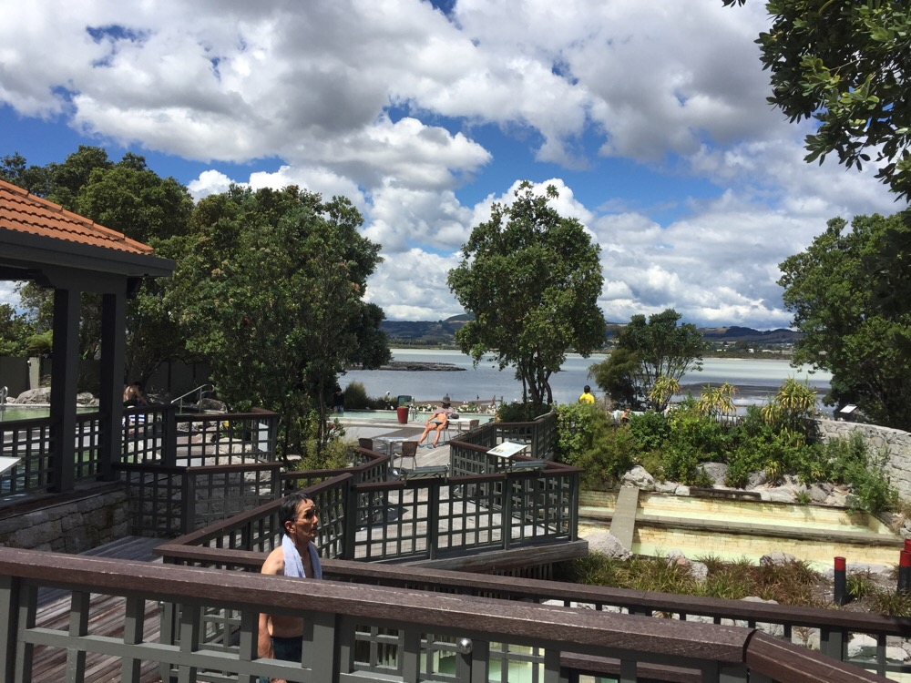
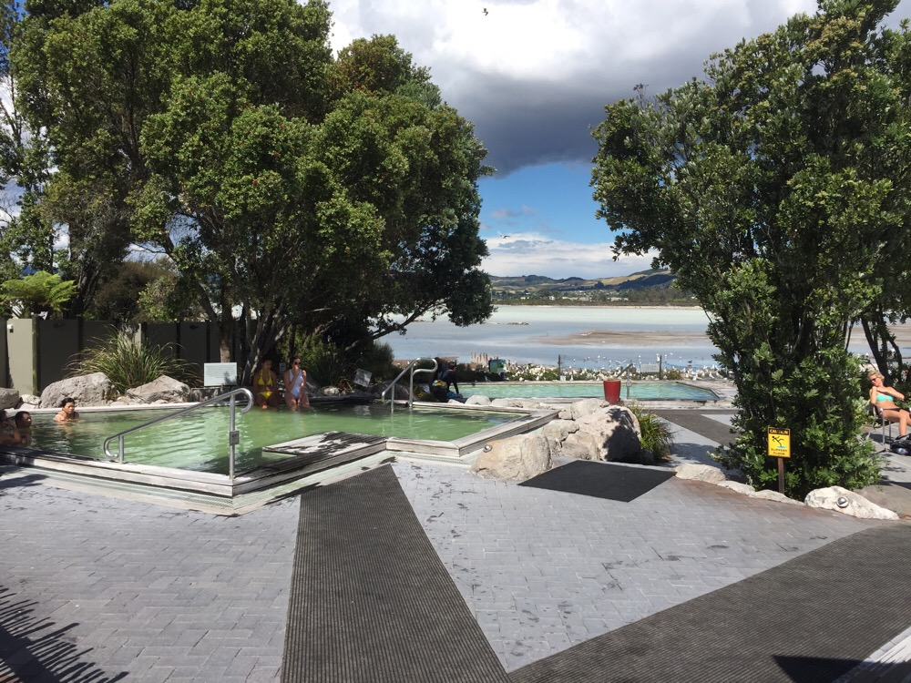

Title: A Day at the Spa... or 45 minutes of Smelling Bad Gas
Date: 2017-01-20 16:29:28.714219
Slug: a-day-at-the-spa...-or-45-minutes-of-smelling-like-bad-gas
Tags: Travel, NewZealand
Status: published
Description: A short day of travel left plenty of time for a stop at the Polynesian Hot Springs Spa

I woke up several times during the night, and each time I did I could hear the rain battering the metal roof of our condo.  Around 5:30 Jane woke up enough to say, "I don't want to go mountain biking on muddy trails." Then she rolled over and went back to sleep.  I figured she was probably right, even if the sun did come out this morning riding 20 miles on mud would not be a good first go at Mountain Biking.  Especially knowing that at the end of the ride we had to get in the car and drive to Rotorua.  After 3 plus weeks on the road we have lost our will to stop at anymore charming roadside waterfalls, so todays trip was just a drive through the countryside. 

So, we lazed around the condo and made a leisurely drive up the east side of Lake Topua.  We walked around the shopping area and had an early lunch at the Master of India restaurant in Topua.  It was quite good, I had the Vindaloo and Jane had Korma, we split an order of Naan and Basmati and some Ginger Beer.  I'm going to have to talk to someone at Fareway about stocking Ginger Beer! After lunch we made our way North for another hour to Rotorua.  We had nothing special planned here as this was mostly meant as a stopover night (in close proximity to Hobbiton) on the way to Auckland.  However the Novotel here by the lake is quite nice, it is right next to Eat Street and we have a view of the lake.

 Jane has been wanting to stop at a volcanic hot spring spa for a few days now, and I have been resisting.  But the brochure for the Polynesian Spa looked pretty nice and they had either a private option or an adult only group of pools.  So, I gave in.  I'm 75% done with Jack Reacher #13 so I could easily have stayed in the room and finished that book.  But that seemed silly.  We decided to go for the adult option because that gave us a choice of 8 different pools and there was no time limit.  We would have to wait for the private pool and then we were limited to 30 minutes.  Anyway, communal bathing is certainly illustrative of many interesting cultural differences.  The pools are constantly fed by natural hot spring water from right under the pools.  There are two types of hot springs here:  One that is good for your joints, and one that tarnishes the gold of your class ring. -- Yes there are warning signs, and **I** took note and left my ring in my backpack.  Jane now has a black 6 in her Luther ring.  Hopefully it can be restored.
 
 My only addition would be to say that the Sulfur and other assorted gasses were rather pungent.  You may have guessed that already.   As a reward for being-a-good-guy-and-going-to-the-spa-with-my-wife, the hotel left a complimentary bottle of  Volcanic Hills Chardonnay by our bed.  Its now two minutes past happy hour so I will post this, and see what we think.  Its from the Hawkes Bay region and so far those have all been good.  New Zealand is really good with their Chardonnays and their Pinot Noirs.  No wonder I like this country.
 
 Later we have a booking for dinner at a nice Italian place right on Eat Street called Leonardo's Pure Italian.
 
 
 
 

