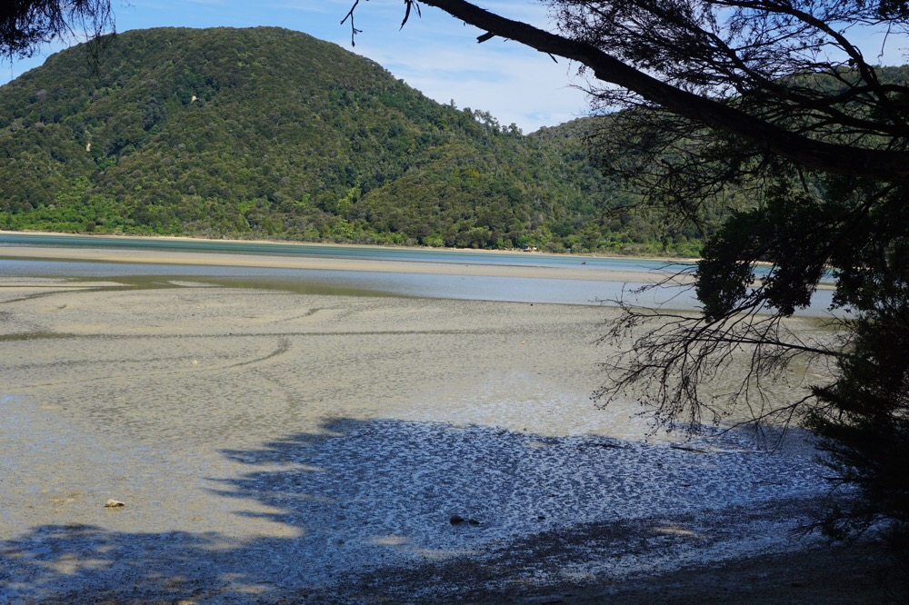
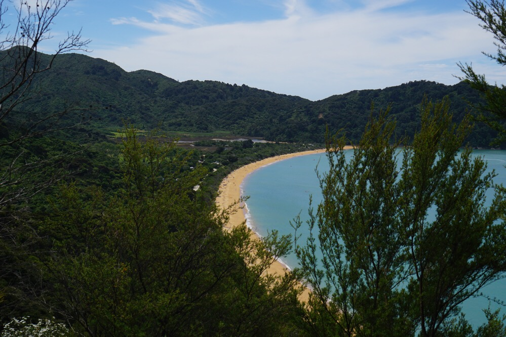
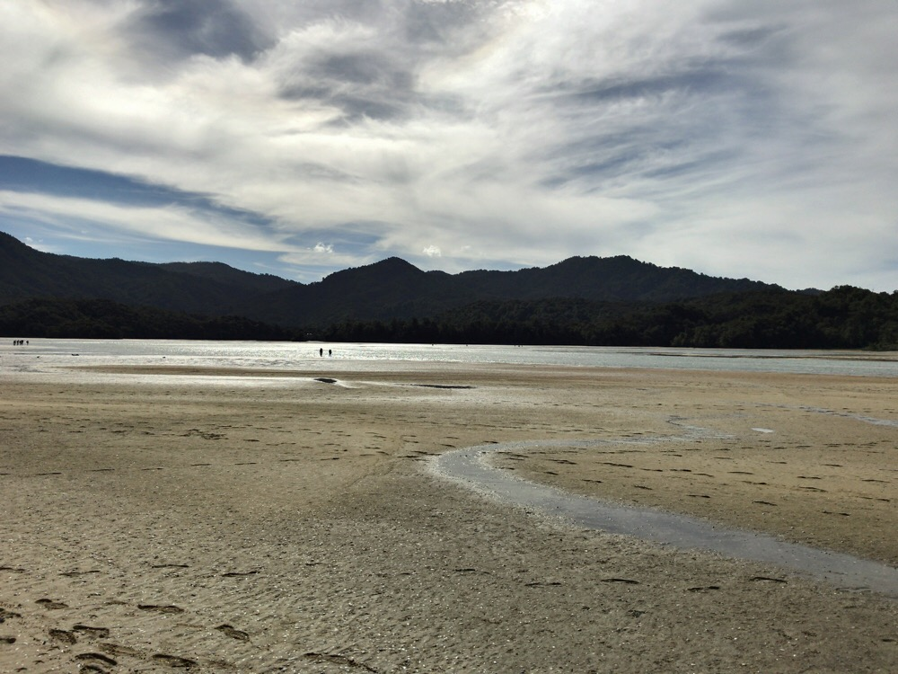

Title: Only Mid Thigh
Date: 2017-01-15 18:27:58.267032
Slug: only-mid-thigh
Tags: 
Status: published
Description: Our first day in the Abel Tasman National Park

Estuary:  the tidal mouth of a river where the river meets the tide.  

The final leg of our hike today ended with an estuary crossing.  We arrived about an hour before low tide so our guide, Jack, suggested that we just chill a bit and wait for the tide to go down before we started our crossing.  So we walked around and counted the tiny little crabs and found some shrimp in a little stream.  then we watched some of the other hikers standing in water up to their knees waiting doubtfully for the tide to ebb.  At last Jack announced we would head out at 5:00, don't worry he said it won't be any higher than mid-thigh.  OK, Jack was a bit shorter than me so I wasn't worried.

The wider darker blue areas will be shallower he said, so aim for those if you are in doubt.   At 5 to 5 Jane and I started walking.  When we got to our knees we encountered the other hikers, still standing and waiting.  I pressed and found a path that came just above my knees.  "This way," I said and just like that I'm a leader.  A bit further on the water got deeper and Jane was nearly to her waist.  I was definitely above mid thigh, and feeling the current of the tide heading out.

That was as deep as it got and so we made it to the other side of the estuary feeling like this was our adventure for the day.  It was a beautiful 7km walk and totally different than the Routeburn.  With the ocean on one side of you at all times and regular boat service to lots of beaches all day long you feel much closer to the "real world" than you do on the Routeburn.  The scenery is also quite different with views of the bay rather than inland lakes.

Like our Routeburn adventure, the day ended at a lodge that has been part of the Wilson family's land since the 1800's, well before this land became a national park.  We had a delicious meal of lamb and mash and salad, and had a good time getting to know the other 8 hikers on our 3 day trip.  We had already met Teresa and Jerad from Melbourne on the bus.   There was also a couple from Northern Ireland (Michael and Dani) on their honeymoon and a family from Adelaide (Ronnie, Jeff, Craig and Lisa).  All were very nice, and once again we had several educators plus some Geologists in the group.  Once again it was a very fine group to share an adventure with and we hope our paths may cross again some day.

