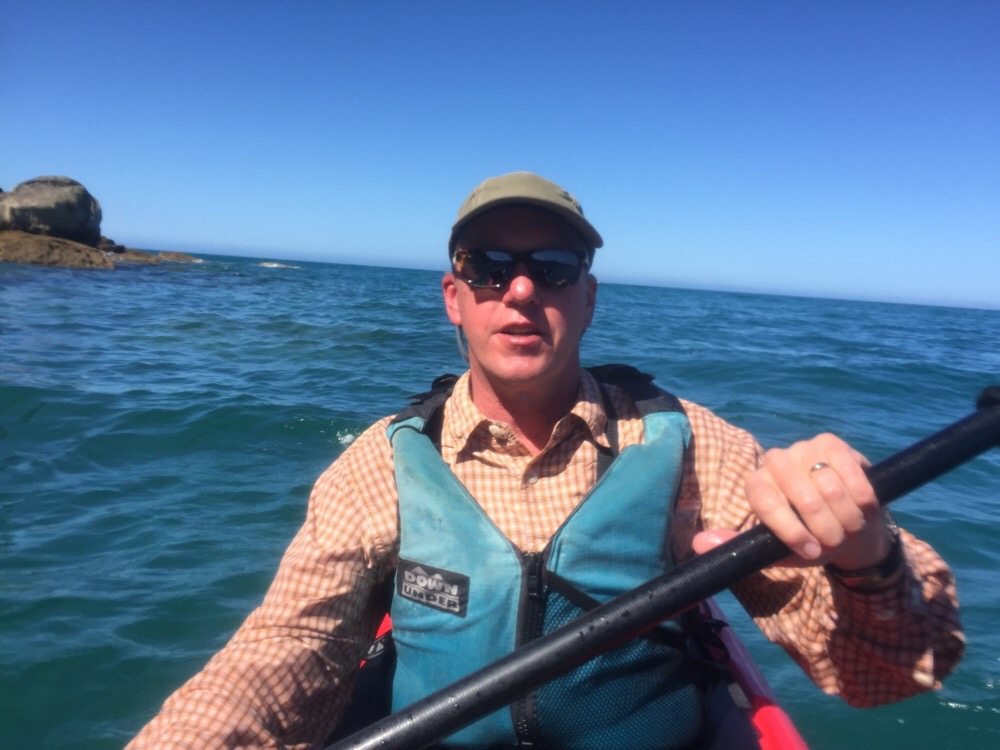
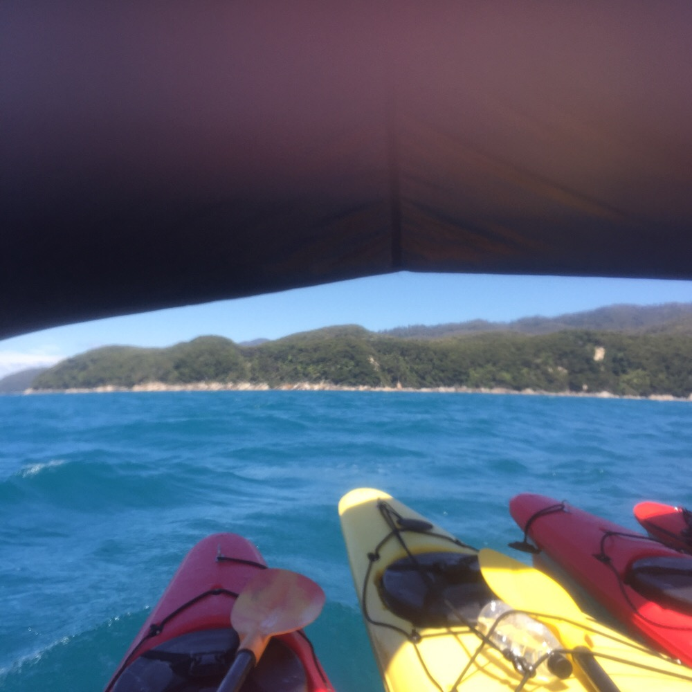
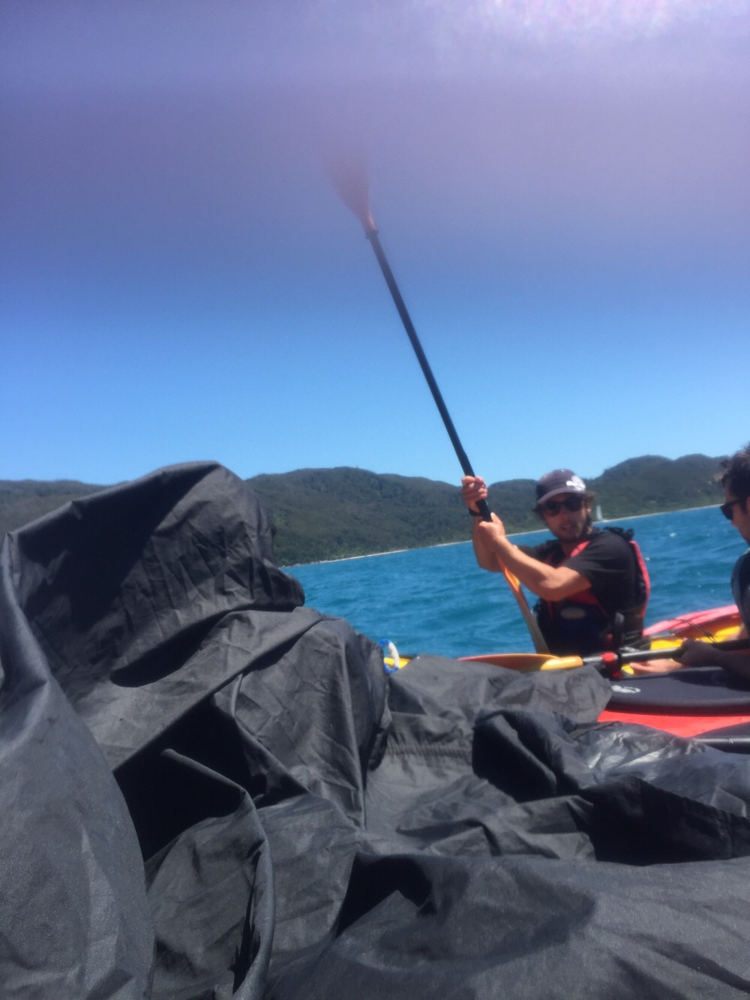

Title: Kayak Sailing
Date: 2017-01-17 18:56:19.143690
Slug: kayak-sailing
Tags: Travel, NewZealand
Status: published
Description: Day 2 of our Abel Tasman adventure brought the chance to sail a Kayak

When Jane told me that if the weather was right we might be able to sail our kayaks I was perplexed.  "How do you add a mast to a Kayak?"  I thought to myself.  So I had mostly put it out of my mind as an option until we were an hour into the first of two two-hour paddles today.  But then "Captain Jack" told us to make a raft and he started talking about how we would sail the kayaks.  The sail consisted of a big black square of fabric with big loops at each corner. We had four Kayaks so the women (Jane and Dani) sitting in the front of the two outside kayaks were instructed to put the loops around their wrists and hold on.  The
men in the two outside back Kayaks (Brad and Michael) were instructed to put the loops around one end of their paddles.  When we put the paddles in our laps and hoisted the sail we were off!  Sadly Kayaking and photography do not go together very well so this is the best picture we have of our sailing adventure.

Kayaking made us both feel pretty old.  about 5 minutes into the second 2 hour leg my arms started to cramp up.  I've been having a little tennis elbow in my left arm lately and that really started to hurt for a bit, luckily after the initial flare up it worked its way out and I was able to paddle.   After 30 minutes both of Jane's hands started to cramp, fingers pointing in all kinds of unnatural directions that needed to be moved back in place manually.  She wasn't able to paddle for more than a few seconds at a time from then on except for a few key places where we really needed both of us to paddle hard.  Incoming waves, outgoing tide, and a river flowing out make for some FUN kayaking conditions along the coast.  I really wish we could have captured them on camera,  but those moments will have to live on in our memories only!

By the time we finished our afternoon of Kayaking we were both done!  Our final day gave us the option of hiking or kayaking and it didn't take any deliberation for us to realize that we had reached our limit.  six more hours of Kayaking was definitely not in our future.  Looking back, we made the right decision, and we enjoyed our final day of hiking very much.

