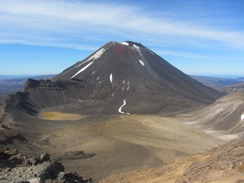
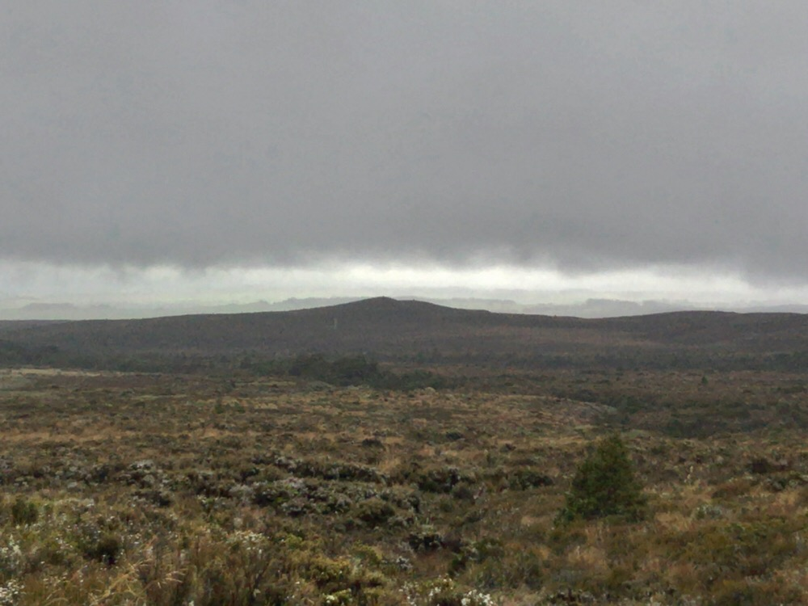
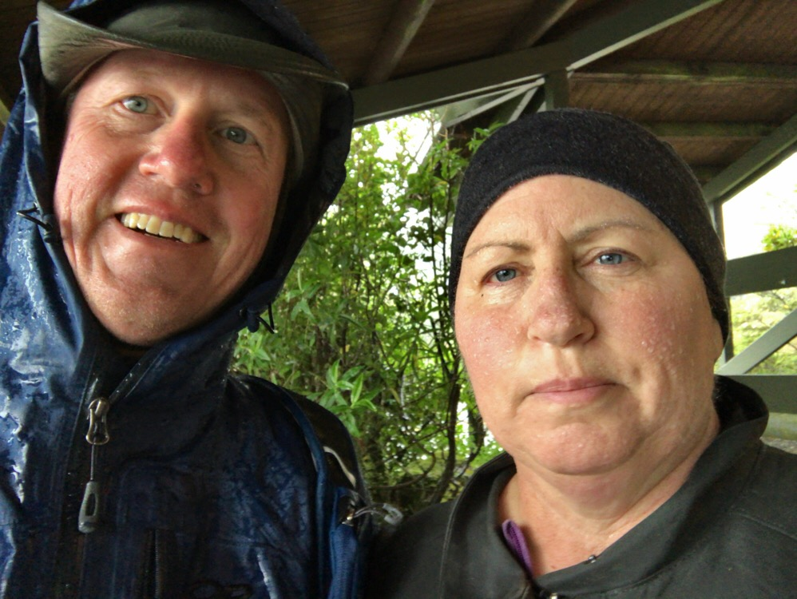

Title: No Mount Doom for You
Date: 2017-01-19 13:07:32.216729
Slug: no-mount-doom-for-you
Tags: Travel, NewZealand, LotR
Status: published
Description: A very rainy day on the North Island of New Zeland

The goal for today had been to bike the Timber Trail.  But since the forecast was for lots of rain we arranged to postpone that until Friday.  My next hope was that we would be able to see Mount Doom .   But we didn't get to see that version (thankfully!), I'll just have to watch the Lord of the Rings again to see that one.    We also didn't get to see this version .  It seems that the weather on the North island has been a bit unsettled.  Instead we saw this . Mount Doom (Mt. Ngauruhoe) might be back there somewhere behind all the clouds.

Instead of hiking the Tongariro Alpine trail for seven hours we took the "easy way out" an hiked the 2 hour trail to Taranaki Falls.  When we started out it was mostly just cloudy and misty.  But just after the falls it got bad, really bad.  The rain was coming sideways and even my mantra about good gear was not enough to overcome the chilling discomfort seeping through my pants and filling my shoes.  The falls were nice but we have seen lots of falls like these in New Zealand.  

<video autoplay loop>
<source src="../images/NZ/rainy_wf.mp4" type="video/mp4" />
</video>

More than anything this walk was to get us out of the hotel and doing something for a portion of our day.   We can't just hang out in our room all day.  Although we have a really nice 2-bedroom apartment that we could enjoy.  We had hoped that the forecast was wrong that that once we got to the visitor center there would be plenty of trails to hike and enjoy.

Thankfully, we have a washer and a dryer, so after today we will have enough clean clothes to make it all the way back home without washing again!  Our shoes are going to require a bit of work to get dry.  We learned a good trick on the Routeburn:  stuff your shoes with newspaper to help them dry overnight.  Our room is pretty short on newspaper though so we'll see what happens.  The dryer is pretty hot so I'm not very enthusiastic about putting them in the dryer and letting them tumble around.

As I write this, I think we might have gotten our day backwards!  I'm looking out the window and at 2:00 in the afternoon the rain has stopped and we are seeing some blue sky.  This is not out of line with the forecast this morning which showed a higher chance of blue sky **and** rain for this afternoon!  There is a winery a few miles away...  Pinot Noir Rose and wood fired pizzas!

