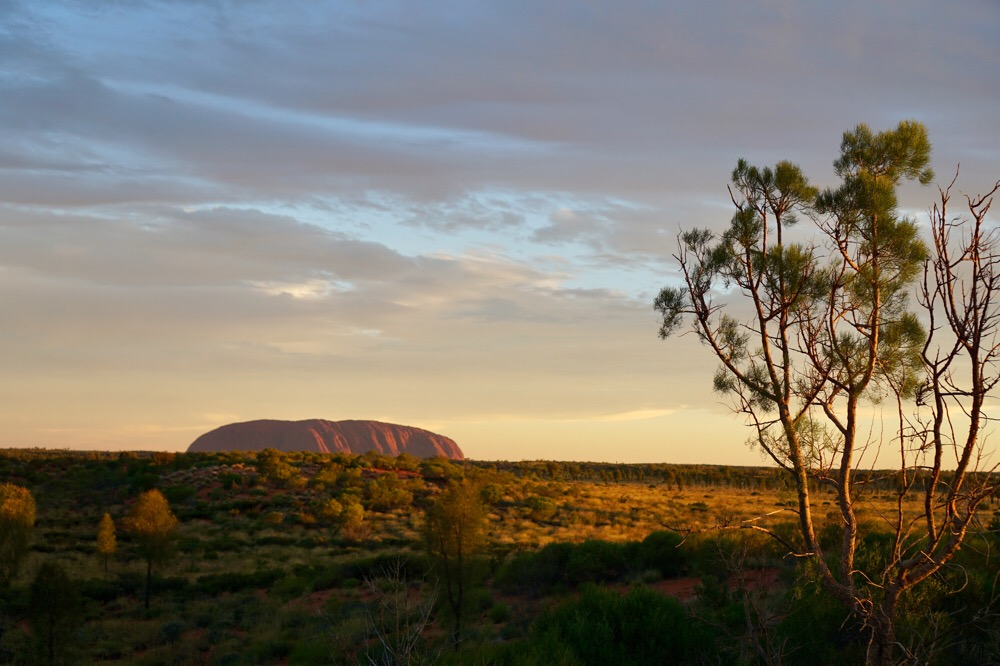
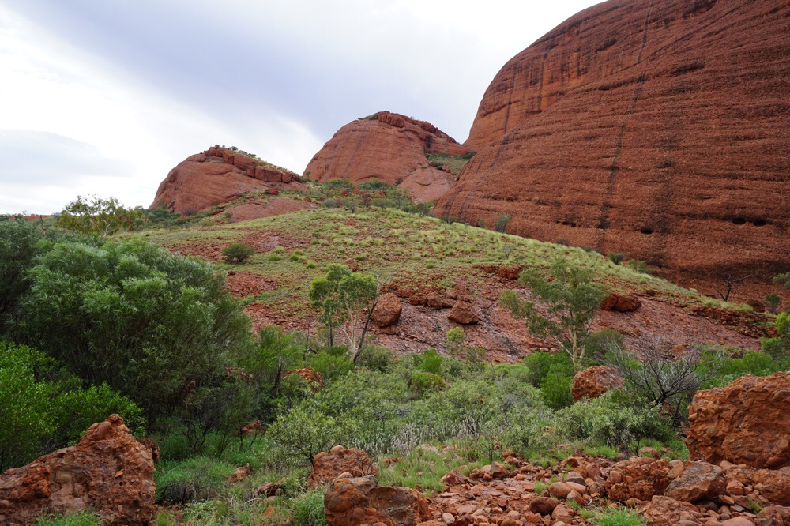

Title: Hiking the Valley of the Winds
Date: 2017-01-05 10:40:47.158173
Slug: hiking-the-valley-of-the-winds
Tags: Travel, Australia
Status: published
Description:  Hiking in the heat and the outback of Australia

Today we flew three hours and 1.5 timezones out of our way to see a big red rock!  I'm not sure where to start unpacking this, the 1.5 timezones or the big red rock.  But if you do a bit of research on Australia and the aboriginal people you will quickly learn about Uluru, or Ayer's Rock.   If you are on the right side of the plane you will get a nice view of this huge rock rising up in the middle of hundreds of miles of flatness.  The picture above was taken at our outdoor dinner experience called "The Sounds of Silence."  There were about 60 of us out on a sand dune in the desert with a great view of Uluru and its sister called Kata-Tjuta.  We were seated at a table with a family from Melbourne and a family from the US.  The one son that I sat next to worked at Google as a software engineer, needless to say we had some good conversation that night.

Our plan had been to rent some bikes and ride around Uluru, but unfortunately last week they had massive rainstorms that washed out many of the trails, so they were closed except for one very short walking trail.  We visited the head of that trail on the afternoon we arrived but didn't go very far as the temperatures were over 100 degrees, and no shade in sight!  We changed our plan to drive a short distance and hike the Valley of the Winds at Kata-Tjuta.

We got up and out the door by 6AM to make sure that we could hike in the coolest part of the day.  They actually will close the hiking trails around 11AM if the temp is forecast to be over 37 Celsius! The hike to this first view point was easy and and a good way to warm up our hiking trail legs.  However when we arrived at the first viewpoint the sign told us that the rest of the trail was closed!  We, and the four other people  that were a few minutes behind us assumed that this was simply a left over from yesterday and they hadn't changed the sign yet that morning.  So, we ignored the sign and pressed on for the Karingana lookout.

What a reward for an excellent little hike!

Although Ayer's Rock is definitely a bit out of the way it was definitely worth the time and effort to see it.  It is considered a sacred place to the Anangu people.  Maybe it was the remoteness of the place or the lack of crowds, but you could definitely get a sense that it was a special place.
