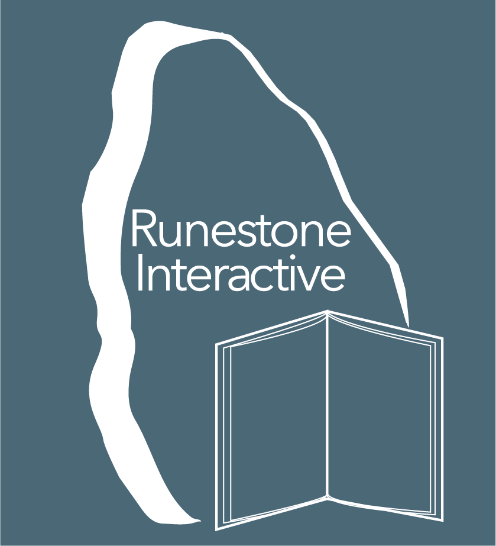

Title: Understanding Entrepreneurship -- Part II -- New Beginnings
Date: 2018-01-31
Slug: understanding-entrepreneurship-2018-2
Tags: Luther, HigherEd, Runestone
Link: 
Description: Lessons learned from JTerm, including when its time to move on.

Whenever I teach this JTerm course on entrepreneurship, friends and colleagues often ask me "do you miss it?"  Meaning do I miss the business world.  The answer has always been, "yes, but I love teaching even more."  This year the answer is different, this year the answer is... "yes, and I'm excited to tell you that I'm leaving Luther to start a new company!"  Spring Semester of 2018 will be my last semester as a full time faculty member at Luther. I have accepted the separation agreement offered by Luther, and I'm really looking forward to the next chapter in my life and career!

This was not an easy decision -- I have enjoyed my time at Luther, and Jane and I could not have asked for a better place to raise our family. JTerm is always a powerful reminder of how great our students are, and how much I enjoy getting to know them beyond the classroom.  But, Kaia and Josh have both graduated from college, Kaia is married, in grad school, with a house, and three dogs in Sioux Falls, Josh has a great girlfriend, and a job he likes in Wisconsin.  In short, they are launched (yay us!). 

We are ready for the next phase of our lives.  So, the house in Decorah is for sale and we have a down payment on a condo in downtown Minneapolis! We close and move in September of 2018! The bike trails are out the back door, we have a view of the Stone Arch bridge, the Guthrie is three blocks away, the light rail to the new MNUFC (Loons) stadium is a four block walk!  It is a 15 minute bike ride to our friends Brian and Holly for happy hour!  What could be better? -- Well, if we could convince a few Decorah friends to move to Minneapolis that would be perfect, but we try not to be greedy.

## Runestone Interactive, LLC

So, this January I've been listening very closely and thinking about how all of these great stories and advice apply to a guy in his mid-50's.  I'm leaving a tenured faculty position, at a college I love dearly to start a new company.  Here is what I take away.

We heard the following from a lot of different people: "follow your passion!"  Well, I admit I've told my students this many many times (although I could write a full post on the perils of telling 19 year olds that they need a passion.)  But I have to say that for as much as I enjoy teaching at Luther College,  [Runestone Interactive](http://runestoneinteractive.org) has definitely become a **passion.**  Runestone has grown from a small project for 30 Luther students few years ago, to supporting over 20,000 students each day from over 600 institutions around the world. This growth has all happened through word of mouth.  No advertising, No booths at trade shows, no sales force, no full time development team!  I really think that Runestone could be 2,000,000 students a day with focus and full time effort. -- Yes, former students, that is what I think about in the shower in the morning!

The separation incentive offered by Luther gives me the opportunity to start a new company, incorporating what I learned from all the mistakes I made the first time around with Net Perceptions, and all of the experience I've gained in the last 15 years of teaching.  It gives me **one year** to figure out if there is a business model that will keep the basic features and the books of Runestone free to everyone, while allowing me to build a small business that pays a salary, and hopefully allows me to bring others on board to work on this with me.  It allows me to (1) follow a passion, (2) make the world a better place and (3) to play my part in "righting the wrong" that is textbook publishing today.  Yes, $300 for a paperback textbook is a wrong!  Wow, count them, that is three awesome reasons to start a company!

## Democratizing Textbooks for the 21st Century
In our discussions of Guy Kawasaki's books during JTerm we talked about companies needing a mantra.  I think that the Mantra for Runestone is "Democratizing textbooks for the 21st century". This could be another whole post, but I'll just say that there is a huge need for computer scientists and there are a lot of well meaning, (but potentially under-prepared) teachers out there who we can help teach computer science.  This is true at the high-school level where computer science is getting traction again, as well as many small colleges where it is almost impossible to find a computer science PhD who is willing to work for what small colleges can pay.  

The second piece of Runestone is in the interactive nature of the books.  Textbooks should not be static, read-only, words.  Textbooks in the 21st century should engage the reader in interactive learning.  Textbooks should also give instructors insight into what their students understand and what their students are struggling with... Textbooks should help answer the question "How can I maximize my time in the classroom today?"

## Get Uncomfortable
We heard a lot about seeking opportunities that make you uncomfortable.  It is through these uncomfortable experiences that you grow.  For the last 15 years this has happened through teaching (especially new courses), and traveling to new places (many times with students) and experiencing new cultures.  Leaving my faculty position -- where I have almost total job security -- is definitely a move in an uncomfortable direction.  Especially for someone over the age of 50. But, I am convinced this is the right thing to do.

## Creating a culture, charting your own course
We heard from a lot of people that had worked in both large and small companies about how great it was to be part of a small organization. in a startup, everything you do is important.  From making the coffee in the morning, to setting strategic direction.  **I get that**. I remember those early days from Net Perceptions.  I miss those days. I miss that sense of ownership for the whole enterprise. The "shared governance" model used by most small colleges is about as far from agile as you can get.

This course reminded me, yet again, why I admire Jeff Bezos and the culture he has built at Amazon.  I was blown away that all of the young people we spoke with at Amazon understood and could talk about many, if not all of,  the 14 leadership principles.  If you don't know them here they are:

* Amazon's Leadership Principles

	* Customer Obsession
	* Ownership
	* Invent and Simplify
	* Are Right, a Lot
	* Learn and be Curious
	* Hire and Develop the Best
	* Insist on the Highest Standards
	* Think Big
	* Bias for Action
	* Frugality
	* Earn Trust
	* Dive Deep
	* Have Backbone; Disagree and Commit
	* Deliver Results

You can get more detail on each of them [here](https://www.amazon.jobs/principles).  But I can only fantasize what a great company Runestone would be if I put these into action.  I also think that higher-ed could benefit from all of these principles, but the conditions are so hard to make this happen!

So as I finish up this post, I have a week until Spring Semester classes begin.  Am I sad that this is my last semester?  Of course! Luther College is such an integral part of my life -- I'm an alumni, a parent of an alumni, a faculty member, and a donor.  I'll only be losing one of those four tags.  I look forward to finding new ways that I can serve the college in the future.  I'll also miss the students and all of the energy they bring.  I'll miss watching them grow and develop into the successful entrepreneurs, developers, and managers that so many of them have become.  In the meantime, I'm going to enjoy my final semester to the max.  I get to teach two of my favorite classes, and I'm eliminating non-essential committee work to go out on a high note!

