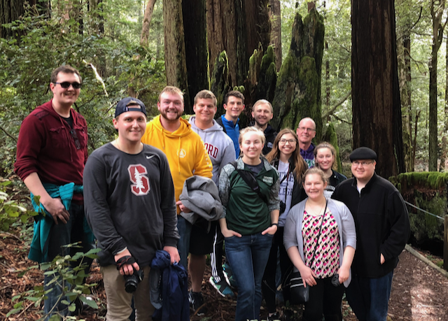

Title: Understanding Entrepreneurship -- Lessons Learned (part I)
Date: January 30, 2018
Slug: understanding-entrepreneurship-2018
Tags: Luther, HigherEd
Link: 
Description: Lessons learned from my JTerm course in Seattle and    the bay area

The students are on the plane home, and I am now in Napa taking a few days of R&R and thinking about what **I learned** during the month of January.  TLDR -- Lots!  But the two things I would like to focus on are the answers to the questions:

1. What can we do better to prepare our students for the real world in the computer science department at Luther College?
2. What stands out the most *to me* from all our meetings?  This  was also a question that some of our hosts asked of the students in the closing days of the course; and one I hope they will reflect on in their final papers.  So, it seems only fair that I do the same.
I'll do this in two parts.  This is part I.

## How can we (Luther CS dept) do better?
One of the best things about this trip was the number of alumni we got to meet with, several of whom are alumni of this course. I'll take a brief diversion to brag a bit -- We have alumni at Amazon, Microsoft, YouTube and Google.  We have alumni at small companies like SafeGraph and Benetech.  All of them were super gracious to meet and host this latest group.

Another standout lesson revolves around continually improving.  We heard lots of great testimonials for "lifelong learning". I think this is one of the consistent themes I've heard at Luther over my 15 years at the college.  As a department, I think that is one of the things we have done well over the years too.  Asking the question regularly about how we can improve.

We asked the Luther alumns a couple of questions each time we met with one.    What advice do you have for the students as they move on from Luther?  What do you wish you had learned at Luther that you did not?

The answer to the second question was nearly unanimous, and quite surprising to me.  It is just two words:  **Unit Testing.**  How interesting, I don't know that I had an answer that I was expecting, but it certainly wasn't that.  But as I reflect on other things we heard it makes sense.

Companies are definitely trending away from the development team  composed of X number of developers and k*X number of QA people.  Now, testing is part of everyone's job and unit tests are a big part of that.  I think there are a number of ways that we can incorporate this into our curriculum at Luther.  The Runestone textbook already uses unit tests to automatically grade a lot of  assignments.  But I think adding them to project based courses like Internet Programming and even the Sr. Project will go a long way toward helping students learn to write and use unit tests.  The biggest obstacle is helping them understand the why.

One of the wisest things I heard on the trip came from a young engineer at Amazon who said, "It's important to remember that unit tests are not for you -- you know your code works.  Unit tests are for the people who come after you and have to make changes."

I have been thinking a lot about unit testing lately as I think it has been a real hinderance to the Runestone project.  People who contribute to open source want to know that they are not breaking your stuff, and the best way to help them over that hurdle is to have a big suite of unit tests.  My new years resolution, which I'm doing pretty well on, is to write a unit test every day until June.  

Its not just newcomers either, its also me in my role as maintainer.  When someone comes with a cool new feature that also changes a bunch of existing code I get seriously anxious.  After all, there are people (teachers and students) that rely on this to work, and I hate to disappoint.

If you are a former student and are reading this I would love to hear from you.  Do you agree?  What else?  What do you think is the best way we can incorporate unit testing into the curriculum?

In Part II I'll talk about my own takeaways from our three weeks.

